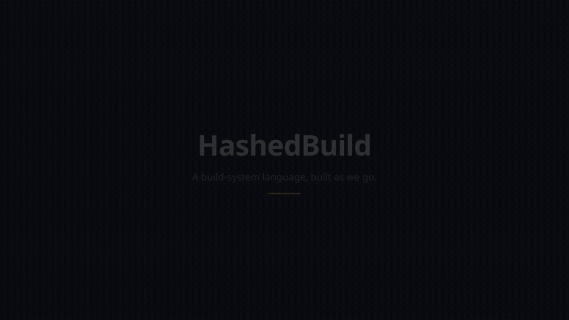

This project is still being developed, even without the core features.
The "README" below is a faked proof-of-concept, meant only to show what I'm heading for approximately.

---

# About

*HashedBuild* helps you describe and instantiate Linux operating systems (and more) with code. It features:
 - output reproducibility (one specific input results in one specific output),
 - incremental updates (a small change should take shorter to build, a big change - longer),
 - standard compliance (what is used here is used also in many other projects),
 - an extensible design (anyone interested is able to write himself/herself any extra features),
 - a standard library (the most common operations are already bulit-in).

See also [NixOS](https://nixos.org/) and [Guix](https://guix.gnu.org/).

# Progress



(Looping preview above - for the full-quality, pausable version, [download the mp4](https://raw.githubusercontent.com/janstrakowski/hashedbuild/main/docs/media/showcase.mp4).)

Want to try any of that yourself? **[GETTING_STARTED.md](GETTING_STARTED.md)** walks through setting up, running, and experimenting with everything shown above.

A real parser and tree-walking evaluator exist now (`src/`, with a full test suite), covering the core expression language - functions, pattern matching, guard chains, real concurrency (`async`, running on actual OS threads) - plus a small set of filesystem builtins with capability-scoped permissions and a live, self-hosted terminal editor with a genuinely pausable/resumable debugger. Unlike the aspirational examples further down, the program below actually runs:

```hashedbuild
// examples/option-picker.hb - reads choice.txt (relative to this file, not
// to wherever `hb` was invoked from), then branches on its exact content.
// "option A" writes output.txt starting with "Option A:" followed by
// optiona.txt's content; "option B" does the analogous thing with
// optionb.txt; anything else is an unrecoverable runtime error.
loadfile "choice.txt" |> filetext as choice
  choice == "option A" then
    createfile {
      .path = "output.txt",
      .content = "Option A:\n" concat filetext (loadfile "optiona.txt"),
    }
  else choice == "option B" then
    createfile {
      .path = "output.txt",
      .content = "Option B:\n" concat filetext (loadfile "optionb.txt"),
    }
  else
    error "choice.txt must contain exactly \"option A\" or \"option B\""
```

Run it with `./hb examples/option-picker.hb` (from anywhere - its paths resolve relative to the script itself, not your shell's current directory), or explore it live with `./hb -i` - a two-to-four-pane terminal editor with a built-in examples picker, a live AST view, and a step-by-step evaluation trace. This one example touches a few of the language's actual design points: files are ordinary values (`loadfile`/`createfile`), branching is built from general composable operators rather than bespoke syntax (`then`/`else` chains into an if/else-if/else), and `error` is a genuinely unrecoverable failure - unlike a failed `then`, no enclosing `else` catches it.

See `SPEC.md` for the full, evolving language design, and `examples/` for more (pipe chaining, sequence-pattern destructuring, variants, optional values, `async`). For a closer look at the debugger itself - stepping through every example one node at a time, including concurrent `async` tasks in lockstep - see the [interactive playback](https://janstrakowski.github.io/hashedbuild/debugger-playback.html) ([source](docs/debugger-playback.html)).

# Examples

The examples below are still aspirational - illustrative of where this is heading, not runnable in the language as it exists today.

## `XZ Utils 5.8.3`
```hashedbuild
gnulinux.containerbuild {
    archive = {
        downloadurl = "https://github.com/tukaani-project/xz/releases/download/v5.8.3/xz-5.8.3.tar.gz",
        sha256 = "CTtEvdGgLSf0FZ86UMI0jbd4rRzCPh9FFAdu8ix3Eyg=",
    },
    packages = { gnulinux.stdpkgs.{ autoconf, automake, gettext, libtool } },
    builder = gnulinux.configuremakeinstall {},
}
```

## "Hello, World!" on [Arduino](https://www.arduino.cc/)
```hashedbuild
let
    programtext = """
        void setup() {
          pinMode(LED_BUILTIN, OUTPUT);
        }

        void loop() {
          digitalWrite(LED_BUILTIN, HIGH);
          delay(1000);
          digitalWrite(LED_BUILTIN, LOW);
          delay(1000);
        }
    """
: arduino.deployment {
    inofiles = { fileFromText programtext },
}
```

# Donate
You can support me by a donation via: [a bank transfer](https://janstrakowski.github.io/jansdonations/) or [BuyMeACoffie](https://buymeacoffee.com/janstrakowski).
